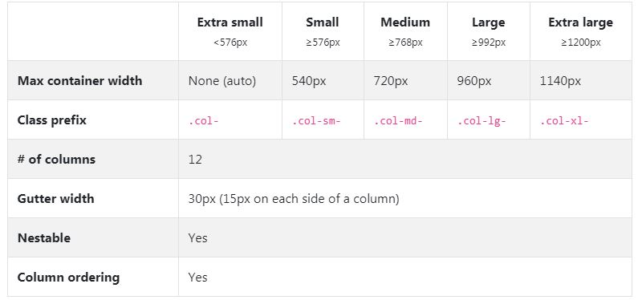

# 20190528-해피해킹 강의 3일차

## 목표

부트스트랩 공식 레퍼런스를 통한 조작 방법 익히자!

## 들어가기 전에

부트스트랩을 사용하기 위하여 CDN을 이용하여야 한다. 다운로드 방법이 있지만 CDN이용이 권장된다. 

아래에 보면 head가 끝나기 전에 링크 한 개와 body가 끝나기 전에 스크랩트 3개가 CDN이다. 

```html
<!DOCTYPE html>
<html lang="en">
<head>
  <meta charset="UTF-8">
  <meta name="viewport" content="width=device-width, initial-scale=1.0">
  <meta http-equiv="X-UA-Compatible" content="ie=edge">
  <link rel="stylesheet" href="https://stackpath.bootstrapcdn.com/bootstrap/4.3.1/css/bootstrap.min.css" integrity="sha384-ggOyR0iXCbMQv3Xipma34MD+dH/1fQ784/j6cY/iJTQUOhcWr7x9JvoRxT2MZw1T" crossorigin="anonymous">
</head>
<body> 
  <script src="https://code.jquery.com/jquery-3.3.1.slim.min.js" integrity="sha384-q8i/X+965DzO0rT7abK41JStQIAqVgRVzpbzo5smXKp4YfRvH+8abtTE1Pi6jizo" crossorigin="anonymous"></script>
  <script src="https://cdnjs.cloudflare.com/ajax/libs/popper.js/1.14.7/umd/popper.min.js" integrity="sha384-UO2eT0CpHqdSJQ6hJty5KVphtPhzWj9WO1clHTMGa3JDZwrnQq4sF86dIHNDz0W1" crossorigin="anonymous"></script>
  <script src="https://stackpath.bootstrapcdn.com/bootstrap/4.3.1/js/bootstrap.min.js" integrity="sha384-JjSmVgyd0p3pXB1rRibZUAYoIIy6OrQ6VrjIEaFf/nJGzIxFDsf4x0xIM+B07jRM" crossorigin="anonymous"></script>
</body>
</html>
```

이전에 웹 개발을 하였을 때는 모든 참조 선언을 head 윗 부분에 하였다. 하지만 부트스트랩 공식 레퍼런스를 참고하니 스크립트는 body 끝나기 전에 선언할 것을 요구하고 있다. 

추가로, CDN이란 지리적, 물리적으로 먼 사용자에게 조차 콘텐츠를 효율적으로 전달하기 여러 노드를 가진 네트워크를 통하여 데이터를 제공하는 방식을 말한다. 예를 들면, 해외 유저가 국내 서비스를 이용할 때 여러 캐시서버 중 가장 가까운 곳의 서버를 통해 콘텐츠를 받게 된다. 


## spacing

margin과 padding 설정을 의미한다.

- mr-0 = margin-right:0px
- mx-0 = margin-left/right : 0px (x는 left와 right를 의미한다)
- py-0 = padding-top/bottom : 0px(y는 top과 bottom을 의미한다.)
- mt-1 = margin-top : 0.25rem
- mx-auto = margin:auto(가운데 정렬을 의미한다.)
- m-2 = margin:2px

## border

border-warning / border-bottom 등의 속성이 있다. 주의할 점은 속성 외에 앞에 border를 사용하겠다는 의미로 border를 하나 더 적어주어야 한다.

## display

d-inline과 d-block으로 설정한다.

## grid

**부트스트랩을 사용하기 위하여 반드시 이해하여야 하는 개념이다. 반응형 웹을 구현하기 위하여 한 줄에 요소들 나누어 배치하기 위한 개념으로 12개의 칸으로 이루어져 있고, 한 줄마다 div.row 안에 요소를 배치하여야 한다.**

>배치 기준이 12개인 이유는 12가 약수가 가장 많기 때문이라고 한다.

아래의 부트스트랩 그리드 표는 공식 레퍼런스 Grid 섹션에서 확인가능하다.



- 01_grid.html

```html
    <div class="row">
      <div class="sqaure col-12 col-sm-6 col-md-4 col-lg-3 col-xl-2">test</div>
      <div class="sqaure col-12 col-sm-6 col-md-4 col-lg-3 col-xl-2">test</div>
      <div class="sqaure col-12 col-sm-6 col-md-4 col-lg-3 col-xl-2">test</div>
      <div class="sqaure col-12 col-sm-6 col-md-4 col-lg-3 col-xl-2">test</div>
      <div class="sqaure col-12 col-sm-6 col-md-4 col-lg-3 col-xl-2">test</div>
      <div class="sqaure col-12 col-sm-6 col-md-4 col-lg-3 col-xl-2">test</div>
      <div class="sqaure col-12 col-sm-6 col-md-4 col-lg-3 col-xl-2">test</div>
      <div class="sqaure col-12 col-sm-6 col-md-4 col-lg-3 col-xl-2">test</div>
      <div class="sqaure col-12 col-sm-6 col-md-4 col-lg-3 col-xl-2">test</div>
      <div class="sqaure col-12 col-sm-6 col-md-4 col-lg-3 col-xl-2">test</div>
      <div class="sqaure col-12 col-sm-6 col-md-4 col-lg-3 col-xl-2">test</div>
      <div class="sqaure col-12 col-sm-6 col-md-4 col-lg-3 col-xl-2">test</div>
    </div>
```

위와 같은 형식으로 Grid가 표시된다. sm-6와 같은 의미가 익숙치 않아 많이 헷갈리기도 했다. 의미는 브라우저 사이즈가 sm(576px)이 넘어가면 12개 중 6칸을 차지하라는 뜻이다.  sm 보다 작은 사이즈일때가 아니라 이후의 사이즈를 말한다. 그렇게 커지다가 md를 만나면 4칸을 차지하도록 사이즈를 변경하게 된다.

## components

활용하고픈 부트스트랩 컴포넌트는 공식 레퍼런스를 통해 확인하자. 많이 사용되는 컴포넌트는 대략 다음과 같다. 개발하다가 막히거나 자주 사용되는 컴포넌트는 아래에 추가로 정리하도록 하자


## Reference

https://www.notion.so/> : 요즘 많이 HOT한 툴이라고 한다. 모든걸 통합하여 문서 관리를 할 수 있다.