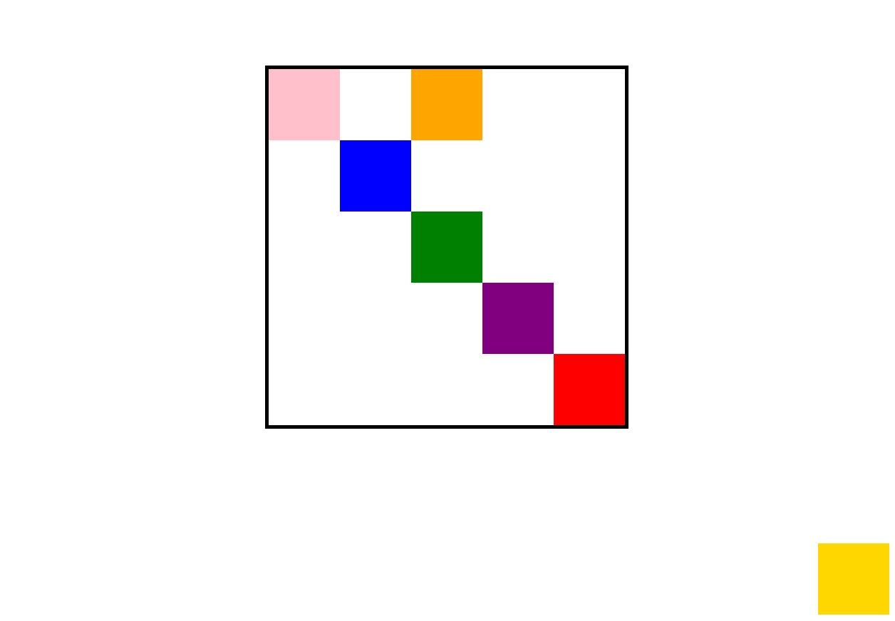

# 20190528 - 해피해킹 강의 3일차

## 목표

기본 CSS 스타일 조작 방법 익히기! (파이썬 기반)

## 들어가기 전에

들어가기 전에 코딩에 도움이 되는 파이썬 속성을 변경하자!

1. JSON 설정 변경

   open setting json에서 아래와 같이 설정을 바꿔주자. 

   ```json
   {
       "python.pythonPath": "C:\\ProgramData\\Anaconda3\\pythonw.exe",
       "terminal.integrated.shell.windows": "C:\\Program Files\\Git\\bin\\bash.exe",
       "editor.fontFamily" : "Hack",
       "[html]" : {
           "editor.tabSize":2
       }
   }
   ```

   코드가 망가졌을 때 위에서 설정한 spaces(2)를 적용하기 위하여 beautify 라이브러리를 설정한다.

   >extension -> beautify install -> Crtl + Shift + p -> open keyboards shortcuts -> beautify file의 keybinding 설정!

## 코드 파일 생성하기

기존에는 마우스로 new file을 클릭하여 생성하였는데 터미널을 이용한 더 편한한 방법이 있었다.

```
code [file_name.html]
code [file_name.css]
```

## size

- 기존의 px / % / em은 사용은 권장되지 않는다. 최근 개발 트렌드는 rem!

>1 rem = 16px

- vh과 vw는 부모 요소의 높이와 너비의 1/100의 크기로 적용된다. 만약 브라우저 높이가 900px이면 1vh와 1vw는 각 각 9px이다.
- vmax와 vmin은 최대값과 최소값이 필요할 때 사용한다. 만약 브라우저 사이즈가 1100 * 700 이면 1vmax는 11px, 1vmin은 7px가 설정된다.

```html
<p class="vh">vh</p>
<p class="vw">vw</p>
<p class="vmin">vmin</p>
```

```css
.vh {
    font-size: 5vh;
}

.vw{
    font-size: 5vw;
}

.vmin {
    font-size: 10vmin;
}
```

## color

색상 적용 우선 순위는 !important > ID > CLASS > TAG 순서이다! 그리고 색상을 결정하는 여러 클래스가 정의되어있을 때 클래스 이름 순서는 상관없고 css 에 마지막으로 정의된 클래스 이름의 속성이 적용된다

```html
<p class="bold blue pink">blue pin</p>
```

## Selector

nth-child() 와 nth-of-type()의 미묘한 차이를 이해할 줄 알아야 한다.

```html
<div id="mulcam">
    <h2>어떤것이 선택될까?</h2>
    <p>1111</p>
    <p>2222</p>
    <p>3333</p>
    <p>4444</p>
</div>
```

```css
#mulcam > p:nth-child(2){ /* p는 중요하지 않음 */
    color: red;
}
#mulcam > p:nth-of-type(2){
    color: blue;
}
```

p:nth-child()에서 p는 의미가 없다. 따라서 1111 텍스트에 속성이 적용된다.

## Box model

- margin을 이용하 정렬 기준을 이해하자

  ```css
  margin:auto /*가운데정렬*/
  margin-left:auto /*오른쪽 정렬*/
  ```

  설정값이 4개 일때는 top, right, left, bottom

  설정값이 2개 일때는 (top-bottom), (right-left)

  설정값이 3개 일때는 (top), (right-left), (bottom)

- box-sizing을 이해하는 것이 중요하다. 원래는 padding 값을 주면 div 사이즈 크기가 padding 크기만큼 늘어난다. 하지만 box-sizing을 하면 border를 기준으로 box 크기가 고정되어 이를 기준으로 padding과 contents의 크기 값이 변하게 된다. 

  >div 크기 : content size + padding size + border size
  >
  >content 영역 : content size + padding size
  >
  >width , height : content 영역이 설정됨

  ```html
  <div class="square">
      <p>contents 영역 100 * 100</p>
  </div>
  <br>
  <div class="square padding-10">
      <p>contents 영역 120 * 120</p>
  </div>
  <br>
  <div class="square padding-10 border-box">
      <p>contents 영역 98 * 98</p>
  </div>
  ```

  [CSS 코드 생략]

## Display

block : 항상 새로운 자리에서 시작하여 한줄을 다 차지한다.

inline : 새로운 라인에서 시작하지 않으며 content의 너비만큼 가로폭을 차지한다.

inline-block : inline의 단점(width, height, margin 속성 지정 못함)을 보완하기 위한 것

None :  공간이 사라진다.

visible : default value

hidden : 공간은 차지하지만 보여주지는 않는다. (cf. display's none)

## position

- 05_display.html

무엇을 기준으로 하느냐에 따라 위치가 달라지기에 쉽게 헷갈릴 수 있다. 아래 코드로 확인해보자

```html
<!DOCTYPE html>
<html lang="ko">
  <head>
      <meta charset="UTF-8">
      <meta name="viewport" content="width=device-width, initial-scale=1.0">
      <meta http-equiv="X-UA-Compatible" content="ie=edge">
      <title>BOX</title>
      <link rel="stylesheet" href="06.css">
  </head>
  <body>
      <div class="big-box">
          <div class="small-box absolute-box" id="red"></div>
          <div class="small-box fixed-box" id="gold"></div>
          <div class="small-box absolute-box" id="green">
            <div class="small-box relative-box" id="purple"></div>
          </div>
          <div class="small-box relative-box" id="blue">
            <div class="small-box absolute-box" id="orange"></div>
          </div>
          <div class="small-box absolute-box" id="pink"></div>
      </div>
  </body>
</html>
```

- big-box는 position이 relative이다.



- GOLD는 브라우저를 기준으로 항상 right-bottom에 고정시키면 된다. 따라서 fixed로 설정!
- RED는 absolute로 설정하여 relative로 설정된 big-box까지 찾아가고, right와bottom을 0px로 설정!
- GREEN도 RED와 동일하다. 단지 top과 left를 200px로 설정한다.
- BLUE는 기본 위치가 상단왼쪽이다. 이 기준으로 top과 left를 100px로 설정하면 되기에 relative로 설정!
- PINK는 RED와 같이 relative 설정인 부모요소에서 top과 left가 0px이면 된다. 따라서 absolute로 설정!
- PURPLE은 그린의 자식이기에 기본적으로 그린의 위치와 겹친다. 여기서 left와 top을 100px씩 지정하면 되므로 relative
- ORANGE는 relative로 설정된 부모요소인 blue의 기준에서 top:-100px, left:100px이면 되므로 absolute로!

위를 요약하면 아래와 같다.

**relative는 본인 요소의 기준으로 이동하고, absolute는 부모 요소가 static이 아닌 relative인 요소까지 찾아 올라가  이를 기준으로 이동한다.  fixed는 브라우저를 기준으로 한다.** 


## Reference

- http://www.html5test.com/> : 해당 브라우저가 지원하는 HTML을 확인할 수 있다.
- [https://caniuse.com](https://caniuse.com/) : 내가 사용하는 CSS가 어디까지 지원하는지 확인할 수 있다.
- <https://htmlcolorcodes.com/> CSS Color 확인
- https://www.w3.org/TR/css-color-3/

