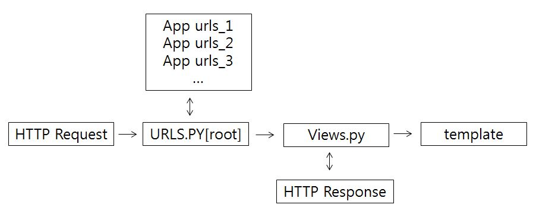
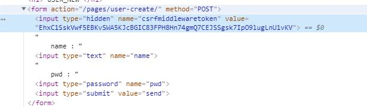

[TOC]

# 20190603 - HappyHacking Study - Django(1)

## 목표

장고의 MVT 패턴과 동작 프로세스, HTML에서의 장고 탬플릿 활용법을 익히자!


## 들어가기 전에

장고 프레임워크 설치법

```
pip install Django
pip list
```


## 장고 기본 세팅 및 애플리케이션 PJT 생성법

` django-admin startpjoject intro` .

intro 라는 웹 가동을 위한 뼈대 폴더가 생성될 것이다.

**파일명 마지막에 '.' 붙여주는 이유는 현재 디렉토리에 생성한 다는 뜻으로 괜히 중간에 폴더가 하나 더 생겨 Dept 가 깊어지는 것을 막기 위한 것이다.**


` python manage.py runserver`

을 통하여 서버가 구동되고 로켓 화면이 출력되는 정상 작동하는 것이다.


settings.py 설정

```python
INSTALLED_APPS = [
    # local apps
    'pages.apps.PagesConfig',
    # third party apps
    # django apps
    'django.contrib.admin',
]
```

위로 쌓는 방식으로 실행할 애플리케이션들을 등록한다.

```python
#LANGUAGE_CODE = 'en-us'
LANGUAGE_CODE = 'ko-kr'
#TIME_ZONE = 'UTC'
TIME_ZONE = 'Asia/Seoul'
```

파이썬은 한글을 지원한다. 설정을 바꿔주자.


` python manage.py startapp pages `

위와 같이 애플리케이션을 생성한다. **단, 이름은 보통 복수로 한다.**


.gitignore 를 설정한다.

gitignore 에서 pycharm 과 django 를 검색하여 해당 내용을 복사한다. .gitignore 라는 파일을 생성 후 내용을 붙여넣기 한 뒤에 마지막에 .idea/ 를 추가해준다.


**Application App 을 생성하기 전에 뼈대 폴더에서 애플리케이션 설정을 진행하면 해당 APP 을 찾지 못한다. 따라서 반드시 App 을 먼저 생성할 것!**


## 장고 프로세스 원리




## 개발 순서

1. view.py 에서 controller 개발
2. urls.py 에 등록
3. templates 개발 (.html)


## 생성되는 파일의 역할

[뼈대 폴더]

- ``__init__``.py : 추후 모듈화를 위한 파일
- settings.py : 장고 프로젝트의 환경 설정
- urls.py : 연결할 애플리케이션의 url 들을 등록한다.

[애플리케이션 폴더]

- urls.py : 요청 url 과 이를 통해 실행할 view 를 등록하는 곳이다. root urls.py 로 부터 실행된다.

  **단, 자동 생성되지 않으므로 폴더를 만들어주어야 한다.**

- views.py : view 를 정의하는 곳으로 컨트롤러단 역할을 한다.


## 데이터 통신

1. URL 에서 '/' 통해 직접 데이터 전달하기

   - view.py

   ```python
   def introduce(request, name, age):
       context = {
           'name' : name,
           'age' : age,
       }
       return render(request, 'intro.html', context)
   ```

   **context 를 보면 마지막 원소에 ',' 이 붙여있다. List도 동일하다. 장고의 특징이다.**

   

   - urls.py

   ```python
   urlpatterns = [
       # 여기서 실제 view 를 파악한다.
       path('', views.index),
       path('intro/<name>/<int:age>/', views.introduce),
   ]
   ```

   **path 설정 시 반드시 마지막에 '/' 붙인다.** 

   **url 은 위로 쌓는 것이 아닌 아래로 추가하는 것이다.**

   

2. GET

   ```python
   def catch(request):
       # print(request.GET)
       message = request.GET.get('message')
       context = {'message' : message}
       return render(request, 'catch.html', context)
   ```

   **request.GET[key_name] 으로 받을 수 있지만 데이터가 없을 때 오류를 발생 시킨다. 따라서 사용 자제!**

   

3. POST

   ` request.POST.get(key_name) `으로 받는다.

   Post 의 경우 CSRF_TOKEN 이란 보안 토큰 설정을 하지 않으면 보안 오류를 발생시킨다. 따라서, 데이터를 Post 로 넘길 .html 에서 ``을 설정한다. 개발자 도구에서 확인하면 해쉬 값이 생성되는 것을 확인할 수 있을 것이다.

   
   
   

## 장고 탬플릿와 기본 탬플릿 설정

flask 에서 jinja template 를 활용하였듯이 비슷한 문법으로 장고 탬플릿을 활용할 수 있다. 

그리고 .html 을 여러개 사용할 때 공통되는 문법으로 불필요하게 코드가 길어지는 경우가 있다. 이럴 경우를 위해 공통 탬플릿을 설정하여 상속하는 방식으로 .html 을 개발할 필요가 있다. 

- base.html

```html
<div class="container">
    
    
</div>
```

- base.html 을 상속하는 .html

```python

원의 넓이 구하기

<h1>원의 넓이 구하기</h1>
<h2>반지름 : {{num}} / 넓이 : {{result}}</h2>

```


## 장고 정적 파일 이해하기

static files 라고 불리우며 Javascript, CSS, Images 등 웹 서비스에서 사용하려고 미리 준비해놓은 정적 파일들이다. 이를 사용하기 위해 애플리케이션 폴더에서 반드시 폴더명을 `static`으로 폴더를 생성한뒤 아래에 정적 파일들을 위치시킨다.

```html
<!--extends 는 항상 최상단에 있어야 한다. -->




<link rel="stylesheet" href="">


<h1>static file example</h1>



```

` ` 와 같이 정적 파일을 사용한다.

## DTL

- dtl_example.html 을 통해 익히자.
